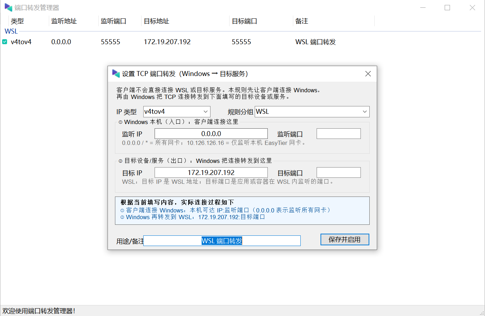

# PortProxyGUI 端口转发管理器

PortProxyGUI 是 Windows `netsh interface portproxy` 的图形化管理工具，用于创建和管理 TCP 端口转发规则。

它适合把 Windows 收到的连接转发到 WSL、Docker 容器、虚拟机、局域网服务器或其他可访问的目标服务。当前版本完成了简体中文界面，并针对 WSL 与 EasyTier 使用场景增加了说明和快捷操作。



## 转发关系

一条规则包含两个端点：

1. **Windows 本机入口**：客户端首先连接的 Windows IP 和端口。
2. **目标服务出口**：Windows 收到连接后，将 TCP 流量转发到的目标 IP 和端口。


例如截图中的规则表示：

```text
手机或其他客户端
    → Windows EasyTier 地址 10.126.126.16:55555
    → WSL 172.19.207.192:55555
```

规则中的监听地址是 `0.0.0.0`，表示 Windows 在所有网卡上监听 `55555` 端口。客户端不能访问 `0.0.0.0`，而应访问 Windows 实际可达的 IP，例如 EasyTier 地址 `10.126.126.16`。

## 字段说明

| 字段 | 含义 | 示例 |
| --- | --- | --- |
| IP 类型 | 入口地址和目标地址使用的 IP 版本 | `v4tov4` 表示 IPv4 转发到 IPv4 |
| 监听 IP | Windows 本机接收客户端连接的网卡地址 | `0.0.0.0`、`10.126.126.16` |
| 监听端口 | 客户端连接 Windows 时使用的 TCP 端口 | `55555` |
| 目标 IP | Windows 将连接转发到的设备或服务地址 | `172.19.207.192` |
| 目标端口 | 目标应用或容器实际监听的 TCP 端口 | `55555` |
| 规则分组 | 用于整理规则，不影响网络转发 | `WSL`、`开发环境` |
| 用途/备注 | 对规则用途的说明 | `WSL 端口转发` |

常用 IP 类型：

| 类型 | 入口 | 目标 |
| --- | --- | --- |
| `v4tov4` | IPv4 | IPv4 |
| `v4tov6` | IPv4 | IPv6 |
| `v6tov4` | IPv6 | IPv4 |
| `v6tov6` | IPv6 | IPv6 |

一般情况下保留自动判断或使用 `v4tov4` 即可。

## 监听地址怎么选

### 监听所有 Windows 网卡

```text
监听 IP：0.0.0.0
```

这会接受发送到 Windows 任意本机 IPv4 地址的连接，包括局域网地址、EasyTier 地址和其他虚拟网卡地址。

### 只允许通过 EasyTier 访问

```text
监听 IP：10.126.126.16
```

将监听 IP 设置为本机 EasyTier 地址后，规则只绑定该地址。客户端应连接：

```text
10.126.126.16:监听端口
```

如果 EasyTier 地址发生变化，需要同步修改规则。

## 快速创建 WSL 转发

1. 以管理员身份运行 `PPGUI.exe`。
2. 在规则列表中单击右键。
3. 选择 **新建 WSL 转发...**。
4. 程序会读取默认 WSL 发行版当前的 IPv4 地址，并填入目标 IP。
5. 填写监听端口和目标端口。
6. 检查窗口底部显示的实际连接过程，然后单击 **保存并启用**。

WSL 快捷模式默认填写：

| 字段 | 默认值 |
| --- | --- |
| IP 类型 | `v4tov4` |
| 监听 IP | `0.0.0.0` |
| 目标 IP | 当前默认 WSL 发行版的 IPv4 地址 |
| 规则分组 | `WSL` |
| 用途/备注 | `WSL 端口转发` |

> [!IMPORTANT]
> WSL 重新启动后，内部 IPv4 地址可能变化。如果转发突然失效，请重新获取 WSL 地址并更新规则。

## Docker 与 WSL

如果 Docker 容器运行在 WSL 中，需要先确认容器端口已经发布到 WSL：

```yaml
services:
  app:
    ports:
      - "55555:55555"
```

此时端口转发规则的目标端口应填写 WSL 中实际可访问的端口。例如：

```text
Windows 10.126.126.16:55555
    → WSL 172.19.207.192:55555
    → Docker 容器 55555
```

如果服务只在容器内部监听且没有发布到 WSL，Windows 端口转发无法直接访问它。

## Windows 防火墙

PortProxyGUI 管理 Windows 端口转发规则，但不会自动创建 Windows 防火墙入站规则。

如果其他设备无法连接，请检查：

- Windows 防火墙是否允许对应的 TCP 监听端口。
- 客户端访问的是否为 Windows 实际 IP，而不是 `0.0.0.0`。
- Windows 是否能直接访问目标 IP 和目标端口。
- Windows **IP Helper** 服务是否正在运行。
- WSL 或 Docker 中的应用是否监听了正确端口。

仅开放单个端口的 PowerShell 示例：

```powershell
New-NetFirewallRule `
  -DisplayName "PortProxy TCP 55555" `
  -Direction Inbound `
  -Protocol TCP `
  -LocalPort 55555 `
  -Action Allow
```

该命令需要管理员权限。请按实际端口和网络访问范围调整防火墙规则。

## 主要功能

- 创建、修改、启用、停用和删除 Windows TCP 端口转发规则。
- 支持 IPv4 与 IPv6 之间的转发类型。
- 自动识别默认 WSL 发行版的 IPv4 地址。
- 实时显示“客户端 → Windows → 目标服务”的连接方向。
- 校验 IP 地址、端口范围和重复规则。
- 删除规则前进行确认。
- 使用分组和备注整理规则。
- 导入和导出配置数据库。
- 检查 Windows IP Helper 服务状态。
- 清理 Windows DNS 缓存。
- 记住窗口大小和列表列宽。

## 运行要求

- Windows 10 或 Windows 11。
- 必须以管理员身份运行。
- 当前发布包为 Windows x64 自包含版本，无需另外安装 .NET Desktop Runtime。

程序包含管理员权限清单，启动时 Windows 会显示用户账户控制提示。

## 从源码构建

推荐使用 .NET 8 SDK：

```powershell
dotnet restore .\PortProxyGUI\PortProxyGUI.csproj
dotnet build .\PortProxyGUI\PortProxyGUI.csproj `
  -c Release `
  -f net8.0-windows
```

发布 Windows x64 自包含单文件：

```powershell
dotnet publish .\PortProxyGUI\PortProxyGUI.csproj `
  -c Release `
  -f net8.0-windows `
  -r win-x64 `
  --self-contained true `
  -p:PublishSingleFile=true `
  -p:IncludeNativeLibrariesForSelfExtract=true `
  -p:EnableCompressionInSingleFile=true
```

## 配置与备份

规则说明、分组和界面配置保存在：

```text
%USERPROFILE%\Documents\PortProxyGUI\config.db
```

程序中的导出功能会复制该数据库。重装系统、迁移电脑或批量修改规则前，建议先导出备份。

Windows 实际启用的端口转发规则保存在系统配置中；配置数据库主要保存分组、备注和界面相关信息。

## 使用限制

- Windows `portproxy` 仅提供 TCP 转发，不支持 UDP。
- 本程序不替代 Windows 防火墙配置。
- 目标服务必须能从 Windows 主机直接访问。
- WSL、VPN 或虚拟网卡地址变化后，相关规则需要更新。

## 项目来源与许可证

项目基于 [zmjack/PortProxyGUI](https://github.com/zmjack/PortProxyGUI) 开发。

本项目遵循仓库中的 [LICENSE.md](LICENSE.md)。
